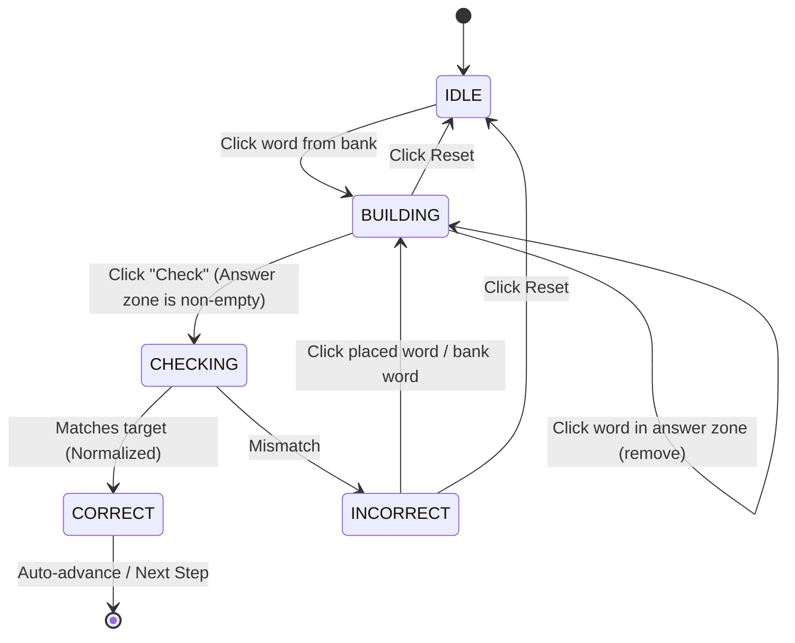

# BuildGame Engine Specification

This document specifies the technical design, runtime behavior, state transitions, and normalization rules for the **BuildGame** engine in the *StudentsWriting* platform. This engine replaces various inconsistent custom implementations and provides a unified, configuration-driven builder.

---

## 1. UX & Interaction Model

### 1.1 Layout Structure
The BuildGame layout consists of three primary zones:
1. **Instruction Zone**: Displays the text prompt/instructions to the student (e.g., *"Assemble the correct sentence using the words below."*).
2. **Answer Zone (Sentence Slot)**: Displays the tokens placed by the student.
3. **Word Bank (Option Pool)**: Displays the clickable word tokens available to be selected.

### 1.2 Interactive Mechanics
- **Click-to-Place**: Clicking an active word token in the *Word Bank* appends it to the end of the *Answer Zone*.
- **Token Disabling**: When a token is clicked from the *Word Bank*, it becomes visually disabled (dimmed/grayed out) but remains in its place within the Word Bank. This prevents layout shift (jitter) while indicating it has been used.
- **Click-to-Undo (Remove)**: Clicking a placed word token in the *Answer Zone* removes it from the sentence. The corresponding token in the *Word Bank* immediately becomes active/re-enabled.
- **Clear/Reset**: Clicking a "Reset" button clears all placed tokens in the *Answer Zone* and resets all *Word Bank* tokens to their active state.

---

## 2. State Machine

The engine transitions between states as follows:



### 2.1 State Definitions
- **IDLE**: No words placed in the *Answer Zone*. The "Check" and "Reset" buttons are disabled.
- **BUILDING**: One or more words placed in the *Answer Zone*. "Check" and "Reset" buttons are enabled.
- **CHECKING**: The engine matches the assembled sentence against the target sentence.
- **CORRECT**: Visual success feedback is shown (green highlights, checkmark). The student can proceed.
- **INCORRECT**: Visual failure feedback is shown (red highlights). The student's placement remains, and they can continue editing (undoing or adding words) to retry.

---

## 3. String Normalization and Comparison

To ensure pedagogical correctness while preventing false negatives due to minor spacing or punctuation errors, the engine normalizes both the student's assembled string and the target string before comparison.

### 3.1 Normalization Function
Both strings are normalized using the following canonical logic:

```javascript
function normalizeForComparison(sentence) {
  return sentence
    .toLowerCase()
    .replace(/[.,!?;:'"]/g, '')  // Strip punctuation marks
    .replace(/\s+/g, ' ')         // Collapse duplicate whitespaces into a single space
    .trim();                     // Remove leading and trailing spaces
}
```

### 3.2 Evaluation Rules
- **Match Criteria**: The student's sentence matches the target sentence if:
  `normalizeForComparison(studentSentence) === normalizeForComparison(targetSentence)`
- **Punctuation Distractors**: If punctuation tokens (like `.`, `,`) are included as separate elements in the `word_bank` for visual placement, they are stripped out during comparison.

---

## 4. Edge Cases and Configuration Rules

### 4.1 `allow_extra` Behavior (Soft Constraint)
The schema defines a boolean field `allow_extra`. 
- **Pedagogical Goal**: Students must decide which words are necessary and which are distractors.
- **Implementation**: The engine enforces a **soft constraint** approach:
  - Extra words in the `word_bank` are fully clickable and can be added to the *Answer Zone*.
  - If `allow_extra === false` and the student includes extra distractor words, the sentence will fail comparison when they click "Check".
  - **Why not a hard constraint (disabling clicks when target length is reached)?** A hard limit would reveal the target sentence length, allowing students to guess the correct words by process of elimination.

### 4.2 Duplicate Words in Word Bank
If the target sentence requires a word multiple times (e.g., *"The dog chased the cat."*), the `word_bank` must contain at least that many instances of the word.
- **Identity Tracking**: Each word in the `word_bank` is rendered as an independent token with a unique React key (e.g., using `index` or a composite ID).
- **Click Resolution**: When a duplicate word is clicked in the bank, only that specific instance becomes disabled. Similarly, when that word is removed from the *Answer Zone*, only its matching bank token is re-enabled.

### 4.3 Layout & Wrap Overflow
- Sentences can grow longer than the browser width. The *Answer Zone* must use CSS flex-wrap (`flex-wrap: wrap`) to wrap tokens to a new line gracefully.
- Do not impose a hard character limit on the *Answer Zone*.

### 4.4 Example Schema
```json
{
  "id": 12,
  "step_type": "build",
  "instructions": "Arrange the words to describe what the dog did:",
  "target": "The dog barked at the mailman.",
  "word_bank": ["The", "dog", "barked", "at", "the", "mailman", "meowed", "cat"],
  "allow_extra": false,
  "explanation": "The correct action is the dog barking at the mailman. 'meowed' and 'cat' are distractors."
}
```
